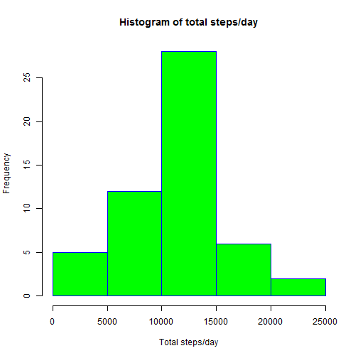
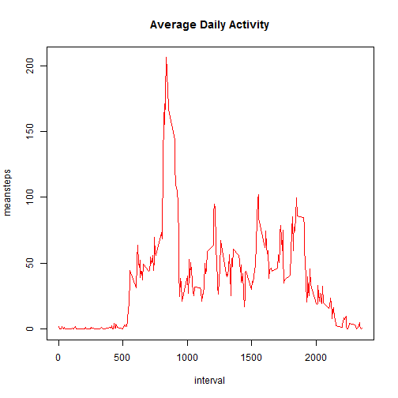
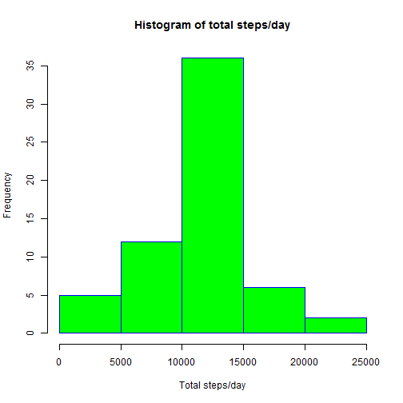
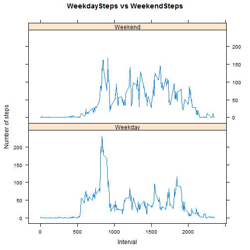

Reproducible Research: Peer Assessment 1
================================

This is a peer graded assignment for the course "Reproducible Research" by Roger Peng of Johns Hopkins University

We start by setting some global options for the knitr file

```r
library (knitr)
library (plyr)
library (lattice)
knitr::opts_chunk$set(echo = TRUE)
```

##Reading the dataset and/or processing the data
This code chunk is to read the dataset from the location in your local directory. Following this, two dataframes are created from this base dataset: activitybyinterval and activitybydate. These two dataframes will help us focus on problems that require calculations by dates and intervals separately.


```r
mylocaldirectory <- "C:/Users/usakuravi/Desktop/ST/Data Science Training/Coursera/Reproducible Research/Course Projects/Course Project 1"    #Assign mylocaldirectory to whichever folder you store your dataset in
setwd(mylocaldirectory)
activity <- read.table("activity.csv", header = T, sep = ",", stringsAsFactors = F)
activity$date <- as.Date(activity$date, format = "%Y-%m-%d")
activitybyinterval <- ddply(na.omit(activity),~interval,summarise,meansteps=mean(steps))
activitybydate <- ddply(na.omit(activity),~date,summarise,totalsteps=sum(steps))
summary(activitybyinterval)
```

```
##     interval        meansteps      
##  Min.   :   0.0   Min.   :  0.000  
##  1st Qu.: 588.8   1st Qu.:  2.486  
##  Median :1177.5   Median : 34.113  
##  Mean   :1177.5   Mean   : 37.383  
##  3rd Qu.:1766.2   3rd Qu.: 52.835  
##  Max.   :2355.0   Max.   :206.170
```

```r
summary(activitybydate)
```

```
##       date              totalsteps   
##  Min.   :2012-10-02   Min.   :   41  
##  1st Qu.:2012-10-16   1st Qu.: 8841  
##  Median :2012-10-29   Median :10765  
##  Mean   :2012-10-30   Mean   :10766  
##  3rd Qu.:2012-11-16   3rd Qu.:13294  
##  Max.   :2012-11-29   Max.   :21194
```

##Histogram of the total number of steps taken each day
This code chunk prints a histogram of the total number of steps taken each day. We use the activitybydate dataframe for this purpose.


```r
hist(activitybydate$totalsteps, main = "Histogram of total steps/day", xlab ="Total steps/day", col="green", border = "blue")
```



##Mean and median number of steps taken each day
This code chunk calculates the mean and median number of steps taken each day. We use the activitybydate dataframe for this purpose.


```r
mean(activitybydate$totalsteps)
```

```
## [1] 10766.19
```

```r
median(activitybydate$totalsteps)
```

```
## [1] 10765
```

##Time series plot of the average number of steps taken
This code chunk plots a time series of the average number of steps against the 5 minute time interval of the day.We use the activitybyinterval dataframe for this purpose.


```r
plot(activitybyinterval, type = "l", main ="Average Daily Activity", col="red")
```



## 5-minute interval with the maximum number (average) of steps
This code chunk identifies and prints the 5 minute interval of the day with the maximum average number of steps.We use the activitybyinterval dataframe for this purpose.


```r
maxsteps <- max(activitybyinterval$meansteps)
activitybyinterval$interval[activitybyinterval$meansteps == maxsteps]
```

```
## [1] 835
```

##Code to describe and show a strategy for imputing missing data
This code chunk identifies missing values of steps in the dataset and imputes the missing value in an interval with the mean number of steps for that interval averaged across all the days. The NAs are replaced with the imputed values to create the new data frame activitynew. The imputing strategy employed based on interval is due to two reasons:

1. The assumption is that the activity is periodic on a daily basis with the interval determining the mean steps rather than taking the mean of steps across all intervals in the particular day, because generally a person is not expected to have the same activity throughout the day. 

2. The days where steps are noticed to be missing have missing steps for all intervals through the day. Hence we cannot take the mean of steps across all intervals in a particular day to impute the missing steps for any interval in that particular day.


```r
len = nrow(activity)
activitynew <- activity
for (i in 1:len)
  if(is.na(activitynew[i,1]))
    activitynew[i,1] <- mean(na.omit(activity$steps[activity$interval == activity[i,3]]))
summary(activitynew)
```

```
##      steps             date               interval     
##  Min.   :  0.00   Min.   :2012-10-01   Min.   :   0.0  
##  1st Qu.:  0.00   1st Qu.:2012-10-16   1st Qu.: 588.8  
##  Median :  0.00   Median :2012-10-31   Median :1177.5  
##  Mean   : 37.38   Mean   :2012-10-31   Mean   :1177.5  
##  3rd Qu.: 27.00   3rd Qu.:2012-11-15   3rd Qu.:1766.2  
##  Max.   :806.00   Max.   :2012-11-30   Max.   :2355.0
```
The summary of activitynew indicates no missing values of steps as they have been imputed.

##Histogram of the total number of steps taken each day after imputation
This code chunk prints a histogram of the total number of steps taken per day using the activitynew dataset with imputed values. A new dataframe activitynewbydate similar to activitybydate but with imputed values is created to help with the histogram.


```r
activitynewbydate <- ddply(activitynew,~date,summarise,totalsteps=sum(steps))
hist(activitynewbydate$totalsteps, main = "Histogram of total steps/day", xlab ="Total steps/day", col="green", border = "blue")
```



##Mean and median number of steps taken each day after imputation
This code chunk calculates the mean and median number of steps taken each day after imputation. We use the activitynewbydate dataframe for this purpose.


```r
newmean <- mean(activitynewbydate$totalsteps)
newmedian <- median(activitynewbydate$totalsteps)
newmean
```

```
## [1] 10766.19
```

```r
newmedian
```

```
## [1] 10766.19
```

Comparing these mean and median values with the mean and median values obtained from the nonimputed dataset, we observe firstly that the mean values are the same. This is understandable as we have imputed the missing values with the mean. Secondly, we observe that the impact of imputing missing data on the median is that the new median value is now equal to the mean value 1.0766189 &times; 10<sup>4</sup>. 

##Panel plot comparing the average number of steps taken per 5-minute interval across weekdays and weekends
This code chunk makes a panel plot containing a time series plot of the 5-minute interval (x-axis) and the average number of steps taken, averaged across all weekday days or weekend days (y-axis). We use the activitynew dataframe for this purpose. We start by identifying what day of the week each date corresponds to and using to create a temporary column named "dayofweek". Then we create a factor variable "weekday_weekend" which categorises all the dates into "Weekday" and "Weekend" based on the dayof week column. We proceed to create new dataframes: "weekdayactivitybyinterval" for the weekday plot and "weekendactivitybyinterval" for the weekend plot.


```r
activitynew$dayofweek <- weekdays(activitynew$date)
activitynew$weekday_weekend <- "Weekday"
activitynew[activitynew$dayofweek %in% c("Saturday","Sunday"), 5] <- "Weekend"
activitynew$dayofweek <- NULL
weekdayactivitybyinterval <- ddply(activitynew[activitynew$weekday_weekend=="Weekday",],~interval,summarise,meansteps=mean(steps))
weekdayactivitybyinterval$weekday_weekend <- "Weekday"
weekendactivitybyinterval <- ddply(activitynew[activitynew$weekday_weekend=="Weekend",],~interval,summarise,meansteps=mean(steps))
weekendactivitybyinterval$weekday_weekend <- "Weekend"
combined <- rbind(weekdayactivitybyinterval, weekendactivitybyinterval)
attach(combined)
```

```
## The following objects are masked from combined (pos = 3):
## 
##     interval, meansteps, weekday_weekend
```

```
## The following objects are masked from combined (pos = 4):
## 
##     interval, meansteps, weekday_weekend
```

```r
xyplot(meansteps~interval|weekday_weekend, layout=c(1,2), type = "l", xlab = "Interval", ylab = "Number of steps", main = "WeekdaySteps vs WeekendSteps")
```


